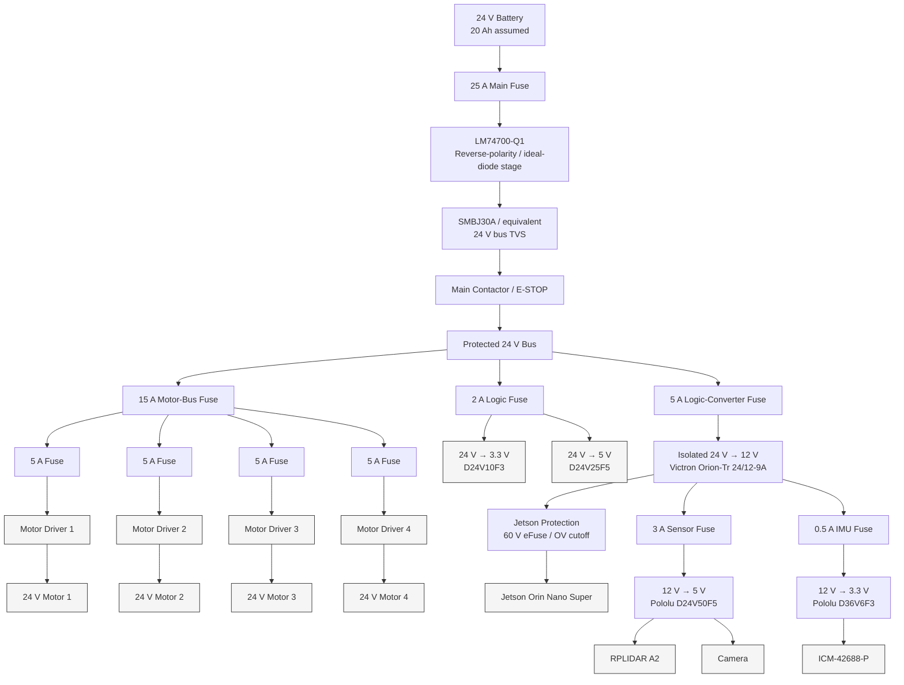
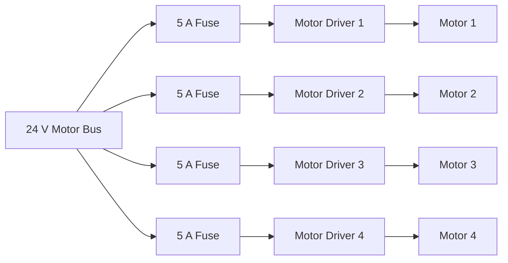
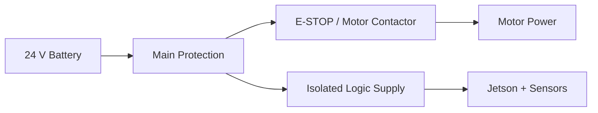

# Problem Statement 05 — Power Budget, Distribution and Protection

## 1. Design Basis

The robot is supplied by a 24 V battery. The design uses the following real components where the problem statement does not provide an exact part number.

| Load | Selected part / assumption | Electrical data used |
|---|---|---|
| Drive motors ×4 | Pololu 30:1 Metal Gearmotor 37Dx68L mm 24 V with 64 CPR encoder, Item #4692 | 24 V, 0.10 A no-load, 0.46 A at maximum efficiency, 3 A stall current |
| Motor drivers ×4 | Pololu High-Power Motor Driver 36v9, Item #756 | 5.5–50 V, 9 A continuous |
| Jetson | Jetson Orin Nano Super Developer Kit | 7–25 W configurable; design at 15 W typical and 25 W peak |
| LiDAR | SLAMTEC RPLIDAR A2 | 5 V, 450–600 mA; allow 1.5 A startup current |
| Camera | Logitech C920-class USB camera | 5 V, 0.5 A design allowance |
| ESP32 | ESP32-WROOM-32E | 3.3 V; 190 mA average and 276 mA peak for the cited 802.11g TX condition |
| Encoders ×4 | Integrated Pololu 64 CPR Hall encoders | 5 V, up to 10 mA per encoder |
| IMU | TDK InvenSense ICM-42688-P | 3.3 V supply; 0.88 mA in low-noise 6-axis mode |
| Battery | 24 V, 20 Ah assumed | 480 Wh nominal energy |

The battery chemistry and exact maximum voltage are not specified by the problem, so this report uses **24 V nominal and 30 V maximum** as the design envelope. Replace this with the actual battery datasheet value before hardware fabrication.

The design principle is to keep the motor/control domain electrically separate from the Jetson/sensor domain. The assignment explicitly asks for layered protection and says not to rely on the battery BMS. 

---

## 2. Power Architecture



### Isolation boundary

The isolation barrier is placed between the **24 V motor/control domain** and the **12 V compute/sensor domain**.

```text
                 MOTOR / CONTROL DOMAIN
                 ----------------------
24 V Battery
     |
     +---- Motor Drivers ---- Motors
     |
     +---- ESP32
     |
     +---- Encoders

             ||  GALVANIC ISOLATION  ||

                 COMPUTE / SENSOR DOMAIN
                 ------------------------
                 12 V
                  |
             Jetson / sensors
```

The ESP32 and encoders remain on the motor side because they are physically close to the motors. Communication between the ESP32 and Jetson must cross the isolation boundary through an isolated interface rather than by tying the two grounds together.

---

## 3. Power Budget

### 3.1 Typical and peak loads

| Load | Voltage | Typical current | Peak current | Typical power | Peak power | Duty / note |
|---|---:|---:|---:|---:|---:|---|
| Motor ×4 | 24 V | 1.84 A total | 12.0 A total | 44.16 W | 288 W | 0.46 A each at maximum efficiency; stall is a short transient |
| Jetson | 12 V | 1.25 A | 2.08 A | 15 W | 25 W | 15 W typical design point, 25 W peak |
| LiDAR | 5 V | 0.525 A | 0.600 A | 2.625 W | 3.0 W | Startup allowance: 1.5 A |
| Camera | 5 V | 0.50 A | 0.50 A | 2.5 W | 2.5 W | Design allowance |
| ESP32 | 3.3 V | 0.190 A | 0.276 A | 0.627 W | 0.911 W | Wi-Fi TX condition |
| Encoders ×4 | 5 V | 0.040 A | 0.040 A | 0.20 W | 0.20 W | 10 mA maximum each |
| IMU | 3.3 V | 0.00088 A | 0.00088 A | 0.0029 W | 0.0029 W | 6-axis low-noise mode |

### 3.2 Total load power

Typical load power:

\[
P_{typ}=44.16+15+2.625+2.5+0.627+0.20+0.0029
\]

\[
\boxed{P_{typ}\approx65.1\ W}
\]

Worst-case electrical peak, treating the four motor stalls as simultaneous:

\[
P_{peak}=288+25+3+2.5+0.911+0.20+0.0029
\]

\[
\boxed{P_{peak}\approx319.6\ W}
\]

The 319.6 W number is a protection-sizing case, not a realistic continuous operating power. Four motors continuously at stall would damage the motors.

---

## 4. DC-DC Converter Sizing

### Isolated 24 V → 12 V

The compute/sensor output requirement at continuous peak is:

\[
P_{12V,peak}=25+3+2.5+0.0029
\]

\[
\boxed{P_{12V,peak}\approx30.5\ W}
\]

Selected converter:

**Victron Orion-Tr 24/12-9A, 110 W, isolated**

The converter has a 16–35 V input range and a 12.2 V nominal output, with a 9 A / 110 W model available.

Converter utilisation:

\[
\frac{30.5}{110}\times100\approx27.7\%
\]

So the converter has substantial transient and thermal margin.

### 12 V → 5 V

The 5 V branch carries:

\[
P_{5V,peak}=7.5+2.5+0.2
\]

where 7.5 W is the RPLIDAR startup allowance.

\[
\boxed{P_{5V,peak}=10.2\ W}
\]

Selected converter:

**Pololu D24V50F5**

- 6–38 V input
- 5 V output
- 5 A typical continuous output
- integrated reverse-voltage, short-circuit, over-current, over-temperature, soft-start and UVLO protection

Available output power:

\[
P_{rated}=5\times5=25W
\]

Therefore:

\[
25W>10.2W
\]

so the 5 V converter is adequately sized.

### 24 V → 5 V motor-side encoder supply

Encoder load:

\[
P=5(0.04)=0.20W
\]

Selected converter:

**Pololu D24V25F5**

- 6–38 V input
- 5 V output
- 2.5 A typical maximum output

Available:

\[
P_{rated}=5\times2.5=12.5W
\]

which is substantially above the 0.20 W encoder requirement.

### 24 V → 3.3 V ESP32 supply

ESP32 peak:

\[
P=3.3(0.276)=0.911W
\]

Selected converter:

**Pololu D24V10F3**

- 3.4–36 V input
- 3.3 V output
- 1 A maximum output

Available:

\[
P_{rated}=3.3W
\]

which is above the 0.911 W design peak.

### 12 V → 3.3 V IMU supply

The IMU requires only:

\[
P=3.3(0.00088)
\]

\[
\boxed{P\approx2.9mW}
\]

A small 3.3 V regulator is therefore sufficient. The report uses the **Pololu D36V6F3**, rated for 3.3 V and 600 mA, followed by local decoupling near the IMU.

---

## 5. Battery Sizing

A 24 V, 20 Ah battery is assumed.

Nominal energy:

\[
E=VQ
\]

\[
E=24\times20
\]

\[
\boxed{E=480Wh}
\]

For an 80% usable-energy assumption:

\[
E_{usable}=480(0.8)
\]

\[
\boxed{E_{usable}=384Wh}
\]

The typical load is approximately 65.1 W at the loads. Allowing 90% average conversion efficiency:

\[
P_{battery,typ}\approx\frac{65.1}{0.90}
\]

\[
\boxed{P_{battery,typ}\approx72.3W}
\]

Estimated runtime:

\[
t=\frac{384}{72.3}
\]

\[
\boxed{t\approx5.3h}
\]

This is an energy-budget estimate. Real runtime will be lower or higher depending on motor duty cycle, terrain, acceleration, battery temperature and actual converter efficiency.

---

## 6. Worst-Case Battery Current

For a conservative peak case, use the 319.6 W electrical load estimate and 90% conversion efficiency:

\[
P_{battery,peak}\approx\frac{319.6}{0.90}
\]

\[
P_{battery,peak}\approx355.1W
\]

At a nominal 24 V battery:

\[
I_{battery,peak}=\frac{355.1}{24}
\]

\[
\boxed{I_{battery,peak}\approx14.8A}
\]

A 25 A main fuse therefore gives protection for the distribution wiring while allowing the short motor-transient case.

---

## 7. Conductor Sizing

The final wire size must satisfy both ampacity and voltage-drop requirements.

The voltage-drop relation is:

\[
V_{drop}=IR
\]

and:

\[
R=\rho\frac{L}{A}
\]

For the preliminary design, copper conductor resistance at 20 °C is used.

### Main battery cable

Assume a 1 m one-way cable between the battery and distribution block, so the electrical loop length is 2 m.

Use **10 AWG copper**.

Approximate resistance:

\[
R_{10AWG}\approx3.28m\Omega/m
\]

Loop resistance:

\[
R_{loop}=3.28\times2=6.56m\Omega
\]

At 15 A:

\[
V_{drop}=15(0.00656)
\]

\[
\boxed{V_{drop}\approx0.098V}
\]

Percentage of 24 V:

\[
\frac{0.098}{24}\times100
\approx0.41\%
\]

This is small enough for the main distribution path.

### Motor branch

Assume 1.5 m one-way length, giving a 3 m loop.

Use **14 AWG copper**.

\[
R_{14AWG}\approx8.29m\Omega/m
\]

\[
R_{loop}=8.29\times3=24.87m\Omega
\]

At the 3 A stall current:

\[
V_{drop}=3(0.02487)
\]

\[
\boxed{V_{drop}\approx0.075V}
\]

\[
\frac{0.075}{24}\times100
\approx0.31\%
\]

### Jetson branch

Assume a 2 m loop and approximately 2.5 A worst-case current.

Use **18 AWG**:

\[
R_{18AWG}\approx20.95m\Omega/m
\]

\[
R_{loop}=20.95\times2=41.9m\Omega
\]

\[
V_{drop}=2.5(0.0419)
\]

\[
\boxed{V_{drop}\approx0.105V}
\]

\[
\frac{0.105}{12}\times100
\approx0.88\%
\]

### 5 V sensor branch

Assume a 2 m loop and 2 A startup current.

Use **18 AWG**:

\[
V_{drop}=2(0.0419)
\]

\[
\boxed{V_{drop}\approx0.084V}
\]

At a 5 V rail:

\[
\frac{0.084}{5}\times100
\approx1.68\%
\]

The converter should therefore be placed close to the sensor distribution point and not several metres away from the loads.

---

## 8. PCB Trace Sizing

The problem asks for trace sizing using IPC-2152.

The motor distribution should not be implemented as a narrow PCB trace. It should use a wide external-copper pour or copper plane.

For the design:

- Main motor-bus current: up to 15 A design current
- Motor branch: 5 A protected branch
- Logic branches: below 3 A

Use **2 oz external copper** for the power board.

A preliminary IPC-style calculation for 15 A shows that the required conductor becomes very wide when temperature rise is kept low. Therefore the preferred implementation is:

```text
Battery input
     |
     +=============================+
          wide copper pour
     +=============================+
           motor bus
```

rather than routing the motor bus through a narrow trace.

The final width must be verified against the actual PCB stack-up, copper thickness, ambient temperature and allowable temperature rise using IPC-2152.

Reference: [IPC-2152 — Standard for Determining Current Carrying Capacity in Printed Board Design](https://www.ipc.org/TOC/IPC-2152.pdf)

---

## 9. Fuse Selection

| Branch | Peak design current | Fuse | Reason |
|---|---:|---:|---|
| Main battery | ~14.8 A peak system case | 25 A JCASE | Protects the main battery cable while allowing short transients |
| Motor bus | 12 A simultaneous motor stall | 15 A fuse | Protects the motor-bus wiring |
| Motor 1 | 3 A stall | 5 A fuse | A fault in one driver/motor branch does not remove the other motors |
| Motor 2 | 3 A stall | 5 A fuse | Same |
| Motor 3 | 3 A stall | 5 A fuse | Same |
| Motor 4 | 3 A stall | 5 A fuse | Same |
| Isolated converter input | ~1.6 A peak | 5 A fuse | Protects converter input wiring |
| Jetson | ~2.1 A at 25 W | 3 A eFuse/current limit | Protects the Jetson branch from over-current and over-voltage |
| 5 V sensor rail | ~2.0 A startup | 3 A eFuse/fuse | Protects the 5 V wiring and converter output |
| ESP32/encoder rail | <0.5 A | 1–2 A fuse | Protects the low-current motor-side logic branch |
| IMU | <1 mA | 0.5 A fuse/polyfuse | Protects against a local short |

The Littelfuse MINI 32 V fuse family gives published time-current behavior: at 200% of fuse rating, the opening window is 0.15–5 s, so a fuse should not be treated as an instantaneous switch.

Source: [Littelfuse MINI 32 V fuse datasheet](https://www.littelfuse.com/assetdocs/littelfuse_datasheet_297_mini32v.pdf)

---

## 10. Connector Selection

The main battery connector is an **XT60**.

Published rating:

- 60 A continuous
- 100 A peak
- contact resistance below 5 mΩ

The approximately 15 A system peak is therefore well below its published current rating.

For motor and sensor branches, use locking connectors with a current rating above the branch fuse rating. A 5 A fused motor branch should use a connector rated for at least 5 A under the actual temperature and pin-loading conditions.

Source: [Pololu XT60 connector](https://www.pololu.com/product/2175)

---

## 11. Battery-Level Protection


The **LM74700-Q1** is used as an ideal-diode/reverse-battery protection controller with an external N-channel MOSFET. It supports 3.2–65 V input, reverse-polarity protection and reverse-current blocking.

Source: [TI LM74700-Q1](https://www.ti.com/product/LM74700-Q1)

The TVS is placed close to the power-entry point. A **SMBJ30A** is suitable as a starting point for a 24 V bus because it has a 30 V reverse standoff voltage and 48.4 V maximum clamping voltage at rated pulse current. The motor driver chosen here has a 50 V absolute maximum, so the exact transient waveform still needs to be checked on the actual battery and wiring.

Source: [Diodes Incorporated SMBJ30A](https://www.diodes.com/part/view/SMBJ30A)

---

## 12. Motor Branch Protection

Each motor gets its own fuse.



The selected motor has a published 3 A stall current. The 5 A branch fuse allows the legitimate short-duration stall/acceleration current while keeping the branch protected.

The selected **Pololu High-Power Motor Driver 36v9** supports 5.5–50 V and up to 9 A continuous output, so the driver voltage range is compatible with the assumed 24 V bus and has more continuous current capacity than the 3 A motor stall figure.

Sources:

- [Pololu 24 V 30:1 gearmotor with 64 CPR encoder](https://www.pololu.com/product/4692/specs)
- [Pololu High-Power Motor Driver 36v9](https://www.pololu.com/product/756)

---

## 13. Grounding and Isolation

The ground topology is:

```text
                     24 V BATTERY
                      +       -
                      |       |
                      |     POWER STAR
                      |       |
                 Motor Bus    +---- Motor Driver returns
                      |
                  Motor-side
                   Ground
                      |
          ESP32 + Encoders

          ||||||  ISOLATION  ||||||

                  Logic-side
                   Ground
                      |
              Jetson + sensors
```

There is **no direct DC connection between motor-side ground and logic-side ground**.

Communication signals crossing the boundary must use galvanically isolated interfaces. Do not defeat the isolation by connecting the two grounds together elsewhere.

This is the key protection mechanism for the Jetson.

---

## 14. Power Sequencing

### Startup

1. Main disconnect is closed.
2. The input capacitors are precharged.
3. The main contactor closes.
4. The isolated 12 V converter starts.
5. Jetson and sensors become powered.
6. The controller checks power-good and communication status.
7. Motor drivers are enabled last.

### Shutdown

1. Motor outputs are disabled.
2. Motor contactor opens.
3. Jetson and sensor rails remain alive briefly for fault logging.
4. Logic power is then removed.

The motor drivers should never be enabled before the controller is ready and valid commands are available.

---

## 15. E-Stop

The E-stop should remove **motor power**, not necessarily every electronics rail.



When the E-stop is pressed:

- Motor power is removed.
- Jetson and diagnostic electronics remain powered.
- The controller can log the E-stop event and report the state.

The exact safety contactor and E-stop circuit should be selected according to the robot's required safety category.

---

## 16. Protection Table

| Protection element | Rating / part | Protects against | Response | Does not protect against |
|---|---|---|---|---|
| Main fuse | 25 A JCASE, 32 V | Battery cable short | Time-current fuse action | Slow over-temperature of a device |
| Reverse-polarity stage | LM74700-Q1 + N-MOSFET | Battery connected backwards | Electronic, fast | Sustained over-current by itself |
| Main TVS | SMBJ30A-class | Fast voltage transients | Nanosecond-scale transient clamping | Long-duration over-voltage |
| Motor-bus fuse | 15 A | Motor-bus wiring short | Fuse time-current response | Individual branch faults unless branch fuses also exist |
| Motor branch fuse | 5 A each | One motor/driver branch short | Fuse time-current response | Mechanical motor overload below fuse threshold |
| Isolated DC-DC | Orion-Tr 24/12-9A | Ground fault propagation | Galvanic isolation | A direct fault on its own output |
| Jetson eFuse | 60 V class, 3 A limit | Over-current and output over-voltage | Electronic current limiting / cutoff | Faults after the eFuse |
| 5 V eFuse/fuse | 3 A | Sensor rail short | Electronic/fuse protection | Internal sensor damage before protection |
| Local filtering | LC / ferrite / capacitors | High-frequency noise | Continuous filtering | Large DC over-voltage |

---

## 17. Fault Walkthrough: 24 V Appears on Logic Ground

This is the main fault that the problem asks us to trace.

### Normal condition

```text
Motor 24 V
    |
Motor ground
    |
    X   <- isolation barrier
    X
Logic ground
    |
Jetson
```

There is no conductive DC path between the two grounds.

### Fault condition

Suppose a motor-side 24 V conductor accidentally touches the logic-side ground.


Because the logic ground is galvanically isolated from the motor supply, there is no normal low-impedance return path through the Jetson.

If the fault instead occurs **inside the logic power path**, the local branch protection operates first. The Jetson branch uses a high-voltage-rated eFuse with an over-voltage cutoff so that a converter failure that raises the 12 V rail toward the 24 V bus is disconnected before the Jetson sees the sustained over-voltage.

The important design rule is that no USB shield, signal wire, chassis bond or other accidental connection should quietly reconnect the two domains.

---

## 18. Other Fault Cases

### Chafed motor wire shorting to chassis

The affected motor branch develops a high current. Its 5 A fuse opens while the other three motor branches continue operating.

### Driver high-side MOSFET fails short

The fault remains local to the motor-driver branch. The branch fuse limits the available fault current and prevents the entire motor bus from being protected only by the main fuse.

### Connector inserted one pin off

Connectors should be mechanically keyed where possible. The affected branch is separately fused/eFused so an incorrect connection is not allowed to pull down the main bus.

### Ground wire comes loose

The isolated logic domain continues to have its own local reference. A motor-return failure therefore does not automatically remove the Jetson's ground reference.

### Converter fails and passes its input voltage to its output

For example:

```text
24 V input
   |
converter failure
   |
24 V appears on nominal 12 V output
   |
high-voltage-rated eFuse detects OV
   |
Jetson branch disconnects
```

This is why a downstream over-voltage cutoff is included in addition to converter protections.

---

## 19. Layout Plan

```text
+-------------------------------------------------------------+
|                     POWER ENTRY                            |
|                                                             |
|  Battery connector                                          |
|       |                                                     |
|  Main fuse  →  Reverse protection  →  TVS                 |
|       |                                                     |
|  Bulk capacitor                                             |
|                                                             |
|==================== HIGH CURRENT ===========================|
|                                                             |
|  Motor bus       Motor Driver 1  Motor Driver 2            |
|  wide copper      Motor Driver 3  Motor Driver 4            |
|                                                             |
|  Keep motor power and switching nodes away from sensor area |
|                                                             |
|=================== ISOLATION BOUNDARY ======================|
|                                                             |
|                 Isolated DC-DC                              |
|                                                             |
|==================== LOW NOISE ==============================|
|                                                             |
|  Jetson branch      5 V sensor rail      3.3 V IMU rail     |
|                                                             |
|  LiDAR              Camera               IMU                |
|                                                             |
|  Test points: TP24V / TP12V / TP5V / TP3V3                  |
|  LEDs:       LED24V / LED12V / LED5V / LED3V3               |
|                                                             |
+-------------------------------------------------------------+
```

The fastest and most sensitive signal returns should remain within the logic area and should not share high-current copper with the motor section.

Motor cables should leave the board from the motor-side edge. Sensor and Jetson cables should leave from the opposite side where practical.

Switching nodes and converter magnetics should have keep-out space around sensitive IMU circuitry.

Fuses should be accessible without removing the entire electronics assembly.

---

## 20. Scaling

### Adding four more motors

With eight identical motors:

\[
I_{stall}=8(3)=24A
\]

The motor-bus wiring, branch count, main distribution and battery current capability must therefore be increased. The logic rails do not double simply because the motor count doubles.

### Changing from 24 V to 48 V at the same power

For the same power:

\[
I=\frac{P}{V}
\]

Doubling the bus voltage approximately halves the current.

That reduces:

- cable current
- cable losses
- voltage drop
- copper requirements

However, the following must be redesigned:

- motor drivers
- motor voltage ratings
- converters
- fuses
- connectors
- insulation and creepage/clearance
- TVS selection
- E-stop/contactors

The 24 V components in this design therefore cannot simply be connected to a 48 V battery.

---

## 21. Parts List

| Function | Part | Quantity |
|---|---|---:|
| Drive motor | Pololu 30:1 Metal Gearmotor 37Dx68L mm 24 V with 64 CPR Encoder, #4692 | 4 |
| Motor driver | Pololu High-Power Motor Driver 36v9, #756 | 4 |
| Jetson | Jetson Orin Nano Super Developer Kit | 1 |
| LiDAR | SLAMTEC RPLIDAR A2 | 1 |
| Camera | Logitech C920-class USB camera | 1 |
| ESP32 | ESP32-WROOM-32E | 1 |
| IMU | TDK InvenSense ICM-42688-P | 1 |
| Main fuse | Littelfuse JCASE 32 V, 25 A class | 1 |
| Branch fuses | Littelfuse MINI 32 V | As required |
| Reverse protection | TI LM74700-Q1 + external N-MOSFET | 1 |
| Main TVS | SMBJ30A, 600 W class | 1 |
| Isolated converter | Victron Orion-Tr 24/12-9A, 110 W | 1 |
| 5 V sensor converter | Pololu D24V50F5 | 1 |
| 5 V encoder converter | Pololu D24V25F5 | 1 |
| 3.3 V ESP32 converter | Pololu D24V10F3 | 1 |
| 3.3 V IMU converter | Pololu D36V6F3 | 1 |
| Jetson branch protection | 60 V-class eFuse with adjustable current/OV cutoff, e.g. TI TPS2662 family | 1 |
| Main battery connector | XT60 | 1 |
| Motor branch connectors | Locking connectors rated above 5 A | 4 |
| Main contactor | 24 V coil, DC-rated contactor above 25 A | 1 |
| Precharge | Resistor + contactor/precharge path sized from measured input capacitance | 1 |

---

## 22. References

### Assignment

1. **Inter IIT Tech Meet — Electrical Problem Statements, Problem Statement 05: Power Budget, Distribution and Protection**
   - Pages 13–15 of the supplied PDF.
   - The assignment requires the power budget, conductor calculations, architecture diagram, protection table, fault walkthrough, board plan and parts list.

### Component datasheets / manufacturer references

2. **Pololu — 30:1 Metal Gearmotor 37Dx68L mm 24 V with 64 CPR Encoder**
   - 24 V, 330 RPM no-load, 0.1 A no-load current, 3 A stall current, 0.46 A at maximum efficiency.
   - https://www.pololu.com/product/4692/specs

3. **Pololu — High-Power Motor Driver 36v9**
   - 5.5–50 V operating range and 9 A continuous output.
   - https://www.pololu.com/product/756

4. **NVIDIA — Jetson Orin Nano Super Developer Kit**
   - 7–25 W configurable power.
   - https://www.nvidia.com/en-us/autonomous-machines/embedded-systems/jetson-orin/nano-super-developer-kit/

5. **NVIDIA — Jetson Orin Nano Developer Kit User Guide**
   - Developer-kit hardware and power-interface information.
   - https://docs.nvidia.com/jetson/orin-nano-devkit/user-guide/latest/

6. **NVIDIA — Jetson Orin Nano Developer Kit Carrier Board Specification**
   - DC jack input specification of 9–20 V and carrier-board electrical limits.
   - https://developer.nvidia.com/downloads/assets/embedded/secure/jetson/orin_nano/docs/jetson_orin_nano_devkit_carrier_board_specification_sp.pdf

7. **SLAMTEC — RPLIDAR A2 Specifications**
   - 5 V, 450–600 mA, 2.25–3 W.
   - https://www.slamtec.com/en/lidar/a2spec

8. **SLAMTEC Wiki — RPLIDAR A2 power guidance**
   - Manufacturer guidance that A2 power should be at least 5 V / 1.5 A.
   - https://wiki.slamtec.com/pages/viewpage.action?pageId=40632342

9. **Espressif — ESP32-WROOM-32E / 32UE Datasheet**
   - 3.0–3.6 V supply and RF current-consumption data including 190 mA average / 276 mA peak for the cited 802.11g TX condition.
   - https://documentation.espressif.com/esp32-wroom-32e_esp32-wroom-32ue_datasheet_en.html

10. **Pololu — 37D motor encoder information**
    - 64 CPR quadrature encoder and 3.5–20 V encoder supply, 10 mA maximum Hall-sensor current.
    - https://www.pololu.com/product/4690/resources

11. **TDK InvenSense — ICM-42688-P Datasheet**
    - 1.71–3.6 V supply and 0.88 mA typical 6-axis low-noise current.
    - https://invensense.tdk.com/wp-content/uploads/2021/06/DS-000347-ICM-42688-P-v1.5.pdf

12. **Victron Energy — Orion-Tr Isolated DC-DC Converters**
    - 24/12-9A, 110 W isolated converter family.
    - https://www.victronenergy.com/dc-dc-converters/orion-tr-dc-dc-converters-isolated

13. **Pololu — D24V50F5 5 V, 5 A Step-Down Regulator**
    - 6–38 V input, 5 V output, up to 5 A typical continuous output, soft-start and protection features.
    - https://www.pololu.com/product/2851

14. **Pololu — D24V25F5 5 V, 2.5 A Step-Down Regulator**
    - 6–38 V input, 5 V output.
    - https://www.pololu.com/product/2850

15. **Pololu — D24V10F3 3.3 V, 1 A Step-Down Regulator**
    - 3.4–36 V input, 3.3 V output, 1 A.
    - https://www.pololu.com/product/2830

16. **Pololu — D36V6F3 3.3 V, 600 mA Step-Down Regulator**
    - 4–50 V input, 3.3 V output, 600 mA.
    - https://www.pololu.com/product/3791

17. **Texas Instruments — LM74700-Q1**
    - 3.2–65 V ideal-diode controller with reverse-polarity and reverse-current protection.
    - https://www.ti.com/product/LM74700-Q1

18. **Diodes Incorporated — SMBJ30A**
    - 30 V reverse standoff, 48.4 V maximum clamping voltage, 600 W class.
    - https://www.diodes.com/part/view/SMBJ30A

19. **Littelfuse — MINI 32 V Blade Fuse Datasheet**
    - Time-current characteristics and temperature derating information.
    - https://www.littelfuse.com/assetdocs/littelfuse_datasheet_297_mini32v.pdf

20. **Pololu — XT60 Connector**
    - 60 A continuous and 100 A peak published rating.
    - https://www.pololu.com/product/2175

21. **IPC — IPC-2152**
    - Standard for determining current-carrying capacity of PCB conductors.
    - https://www.ipc.org/TOC/IPC-2152.pdf

---

## 23. Final Design Summary

The proposed system is based on a **24 V motor/control domain** and an **isolated 12 V compute/sensor domain**.

The four motors are individually fused, so a failed motor branch does not shut down the other motors. The Jetson is powered from the isolated side and has its own high-voltage-rated eFuse/over-voltage cutoff. The LiDAR, camera and IMU have separate protected sensor rails.

The nominal calculated robot load is approximately:

\[
\boxed{65.1W}
\]

with a conservative simultaneous motor-stall electrical peak of:

\[
\boxed{319.6W}
\]

and an estimated battery peak current of approximately:

\[
\boxed{14.8A}
\]

for the assumed 24 V battery.

The architecture is designed so that motor faults remain on the motor side, while the isolation barrier prevents a motor-domain fault from creating a conductive fault path through the Jetson and sensitive sensor ground.

